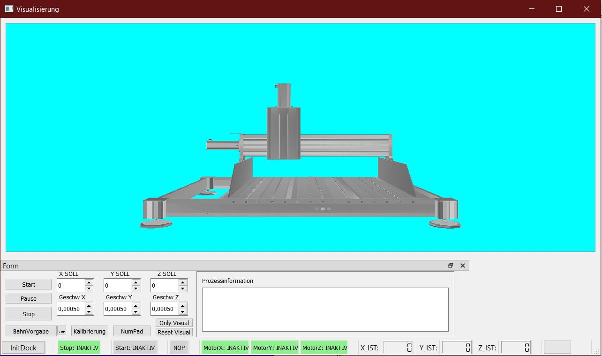

# VisuProject

# Description

[GitHub Page](https://github.com/suly520/VisuProject)

The software application for 3-axis machine control was design in conjunction with a custom built circuit unit with a Raspberry Pi including motor controlers and other electronics, to control the machine. The program offers visualization with Pyside and OpenGl, GPIO emulation, coordinate guidance, and touchscreen capability. It has been optimized for performance using the Cython programming language and is currently under development. It has been "tested" on Windows (only for visualization) and Raspberry Pi OS (Linux).

**Currently most of the code and text is german in futur updates i will translate it to english**
